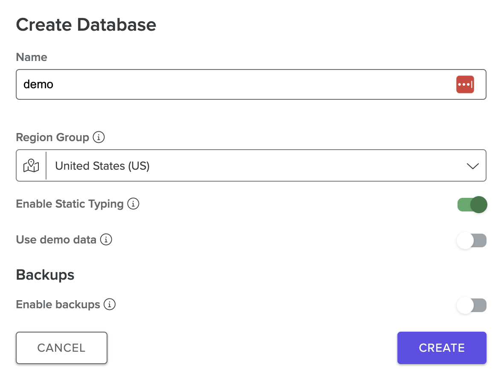

# Weekly live webinar: Introduction to Fauna in 45 minutes
This is the sample project as demonstrated in the weekly live webinar.


## Setup
* Install packages: `npm install`
* Create a database in your [Region Group](https://docs.fauna.com/fauna/current/administration/region_groups)
  of choice.
  
  

* Copy `.env.sample` into `.env` and provide value for `FAUNADB_SECRET`
* Load the sample data:
  ```
  > node scripts/run.js
  ```
* Run the queries:
  ```
  > node query1.js                
  {
    data: [
      {
        status: 'processing',
        customer: { firstName: 'Carol', lastName: 'Clark' }
      },
      {
        status: 'processing',
        customer: { firstName: 'Bob', lastName: 'Brown' }
      },
      {
        status: 'processing',
        customer: { firstName: 'Alice', lastName: 'Appleseed' }
      }
    ]
  }
  ```