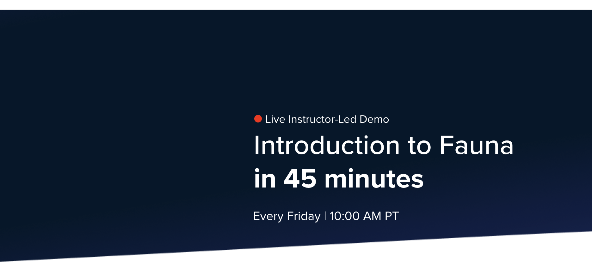
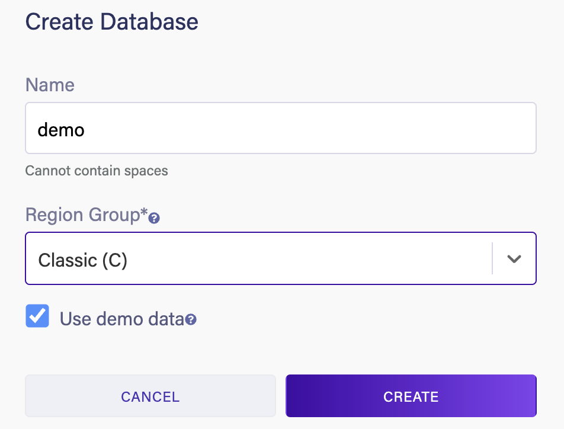
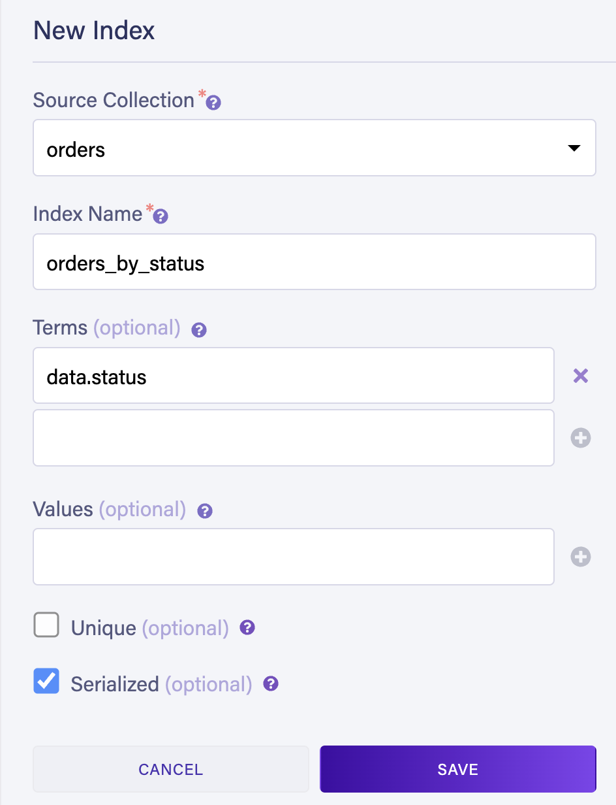

# Weekly live webinar: Introduction to Fauna in 45 minutes
This is the sample project as showned in the weekly live webinar.



## Setup
* Install packages: `npm install`
* Create a database in your [Region Group](https://docs.fauna.com/fauna/current/learn/understanding/region_groups)
  of choice. **Check the "Use demo data" checkbox**
  
  
* The queries use an index that's not included in demo data. Create the `orders_by_status` index manually:

    
* Copy `.env.sample` into `.env` and provide value for `FAUNADB_SECRET`. For `FAUNADB_DOMAIN` 
  use the following depending on which [Region Group](https://docs.fauna.com/fauna/current/learn/understanding/region_groups)
  used.
  | Region Group | FAUNADB_DOMAIN |
  | ------------ | -------------- |
  | US           | `db.us.fauna.com` |
  | EU           | `db.eu.fauna.com` |
  | Classic      | `db.fauna.com`    |
* Run the queries:
  ```
  > node query1.js                
  {
    data: [
      {
        status: 'processing',
        customer: { firstName: 'Carol', lastName: 'Clark' }
      },
      {
        status: 'processing',
        customer: { firstName: 'Bob', lastName: 'Brown' }
      },
      {
        status: 'processing',
        customer: { firstName: 'Alice', lastName: 'Appleseed' }
      }
    ]
  }
  ```